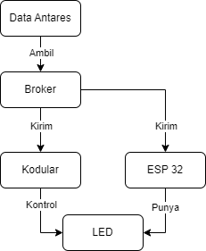
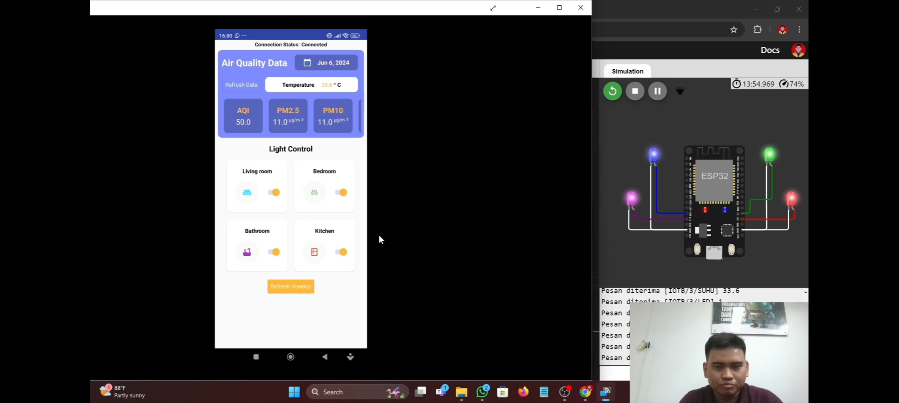

# uas-iot-kelas-b

**Judul Projek**
"Pemantauan Kualitas Udara dan Kontrol Pencahayaan Hemat Energi Berbasis IoT"

**Nama & NIM Anggota Kelompok**
1. Muhammad Irvan Hakim 	(2109106057)
2. Muhammad Dhimas Eko Wiyono 	(2109106068)
3. Maulana Muhammad Hafidz 	(2109106070)

**Note:**
1. Kodingan dan Komponen ada pada link Wokwi
2. Projek Kodular ada pada folder "UAS"
   
**Link Wokwi:**
https://wokwi.com/projects/399376745850423297

**Diagram Blok:**

**Hasil Pengujian:**

